<h1>Rapport de TP N°3-4 : Projet Spring Boot avec Spring Security</h1>
<h2>Development Web JEE Spring MVC</h2>
<h2>Introduction</h2>

Ce projet concret se concentre sur la conception d'une application web sécurisée,
spécifiquement orientée vers la gestion exhaustive des dossiers patients en exploitant les 
frameworks Spring Boot et Spring Security. L'ensemble du code fourni érige un socle robuste en 
mettant en lumière des fonctionnalités essentielles telles que la création, la lecture, la mise à jour 
et la suppression (CRUD) des données relatives aux patients.
 
L'objectif initial consiste à configurer une application Spring Boot,
mettant en avant les fonctionnalités flexibles et puissantes du framework.
La sécurité est une préoccupation majeure, avec l'implémentation 
de trois stratégies d'authentification différentes : 
<ul>
<li>InMemoryAuthentication</li>
<li>JdbcAuthentication</li>
<li>l'utilisation d'un service UserDetailsService.</li>
</ul>
Au départ, l'objectif principal est de paramétrer une application Spring Boot, mettant en valeur la 
souplesse et la puissance de ce cadre de développement. La sécurité représente une préoccupation 
primordiale, se manifestant par la mise en place de trois stratégies distinctes d'authentification.

Une caractéristique marquante de ce projet réside dans la gestion de deux bases de données 
différentes, H2 et MySQL. Cela démontre la flexibilité de Spring Boot en matière de connexion 
à différentes sources de données.

<h2>Ennoncé</h2>

Développer une application Web JEE en utilisant Spring MVC, Thymeleaf et Spring Data JPA
pour la gestion des dossiers patients. Cette application devra offrir les fonctionnalités suivantes :

<ul>
<li>Stocker dans H2 DataBase puis dans MySQL</li>
<li>Afficher les patients</li>
<li>Faire la pagination</li>
<li>Chercher les patients</li>
<li>Ajouter un patient</li>
<li>Modifier un patient</li>
<li>Supprimer un patient</li>
<li>Sécuriser les données des utilisateurs</li>
<li>Gérer les droits d'accès</li>
</ul>
<h2>Objectifs</h2>
<ol>
<li>Créer un projet spring boot avec les dépendances Web, Spring Data JPA, H2,
Lombok, Thymeleaf et MySQL</li>
<ul>
<li>Créer l'entité JPA Patient</li>
<li>Créer l'interface PatientRepository basée sur Spring Data</li>
<li>Configurer l'application pour se connecter soit à h2 Database ou à MySQL (application properties)</li>
<li>Créer le contrôleur Spring MVC</li>
<li>Créer les vues basées sur Thymeleaf </li>
</ul>
<li>Sécuriser cette application en intégrant un système d'authentification basé sur Spring security avec les trois stratégies: 
<ul>
<li>InMemoryAuthentication</li>
<li>JdbcAuthentication</li>
<li>UserDetailsService</li>
</ul>
</ol>
<h2>Conception</h2>
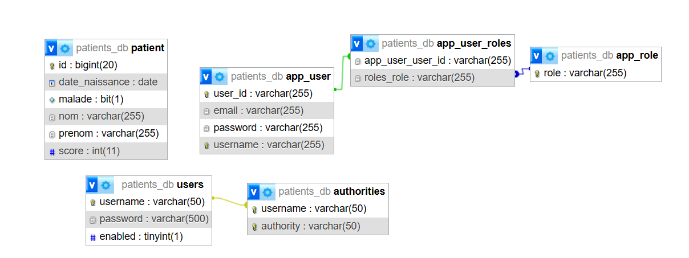
<h2>Réalisation</h2>
<ol>
<li>Création du projet spring boot avec les dépendances Web, Spring Data JPA, H2,
Lombok, Thymeleaf qui sert à:</li>
<ul>
<li>Afficher les données des patients dans H2 DataBase et dans MySQL</li>
<h3>SQL</h3>
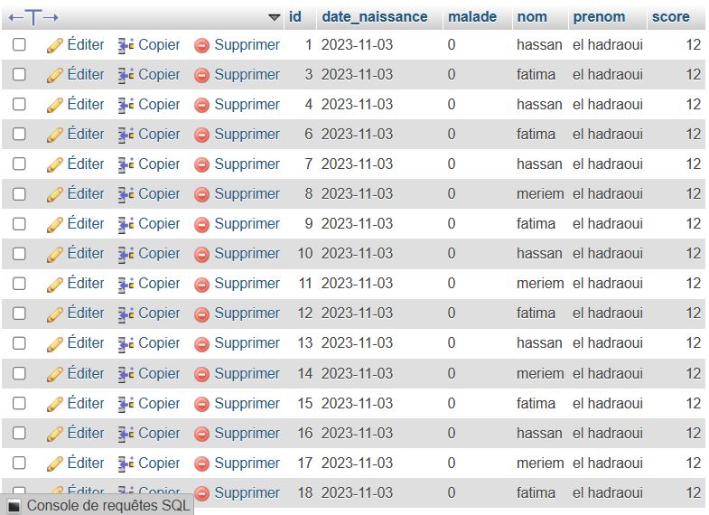
<h3>H2</h3>
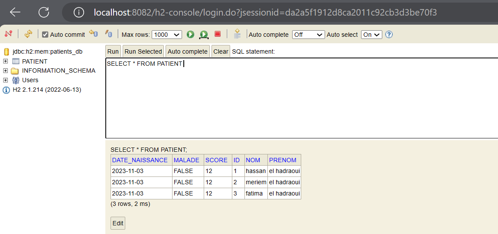
<li>Afficher les patients</li>

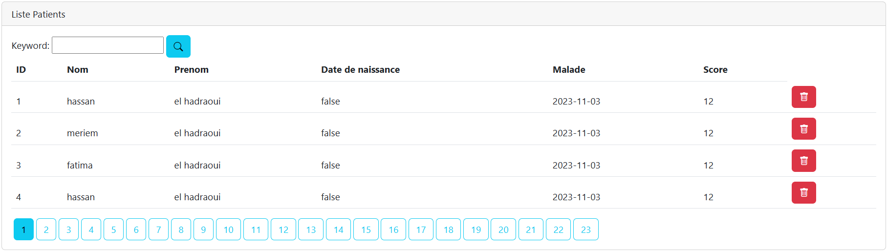
<li>Faire la pagination</li>
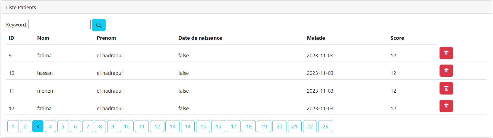
<li>Chercher un patient</li>

<li>Ajouter un patient</li>

<li>Modifier un patient</li>

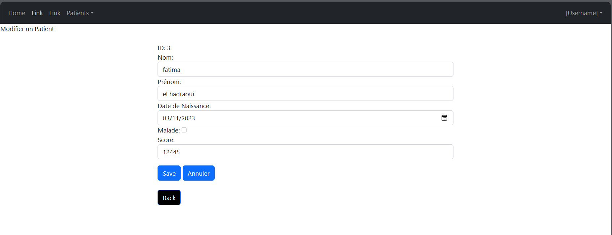

<li>Supprimer un patient</li>
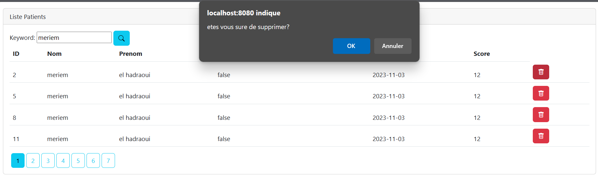
voila on a supprimé les patients qui ont  les ids  5 et 2
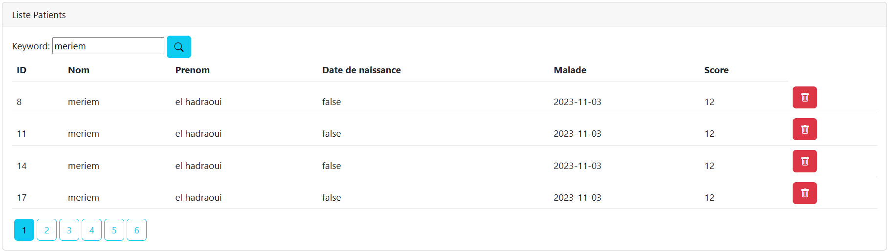

<li>Validation des données </li>
<ol>
    <li>Ajout de l'annotation de validation Spring : <code>@Valid</code></li>
    <li>Ajout des annotations de validation appropriées sur les champs concernés.</li>
    <li>Au niveau du contrôleur, utilisation de <code>@Valid</code> et de l'objet <code>BindingResult</code> pour gérer les résultats de la validation.</li>
    <li>Enfin, au niveau du code HTML, utilisation de l'expression Thymeleaf <code>th:errors</code> pour afficher les messages d'erreur en cas de validation échouée.</li>
</ol>

</ul>
<li>Sécuriser cette application en intégrant un système d'authentification basé sur 
Spring security .</li>
<h3> Installation de Spring Security</h3>
Lors de l'installation de Spring Security, celui-ci génère automatiquement cette page d'authentification.
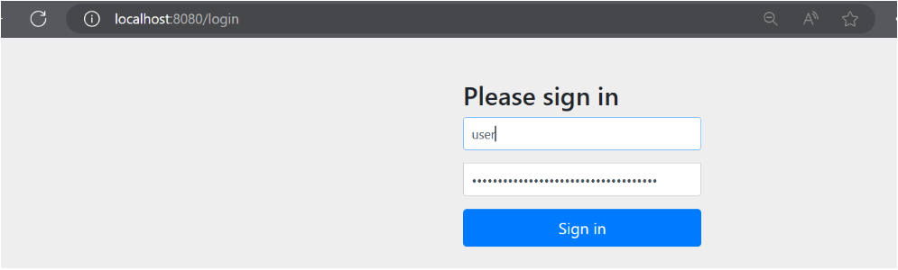
Un mot de passe est généré et constitue le seul moyen d'accéder à cette page.
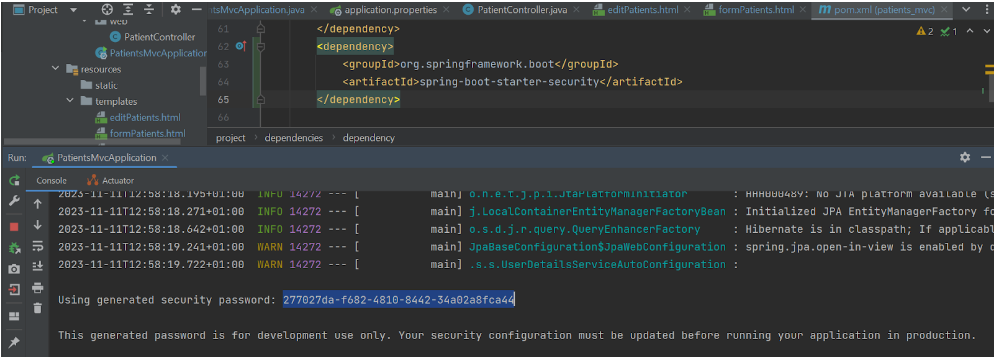
Pour personnaliser la configuration de Spring Security, nous créons la classe `SecurityConfig` 
dans le package security. Plutôt que d'opter pour l'approche conventionnelle des requêtes HTTP 
autorisées dans la configuration de sécurité, nous choisissons de désactiver la préconfiguration en 
utilisant `@EnableMethodSecurity(prePostEnabled = false)`. Ensuite, au niveau du contrôleur, nous 
adoptons une approche plus flexible en utilisant l'annotation `@PreAuthorize("hasRole('ROLE_ADMIN')")`.
Ce changement permet une gestion plus détaillée des autorisations directement au niveau des méthodes, 
offrant ainsi une solution plus élégante et adaptable pour définir les permissions en fonction des rôles
des utilisateurs.
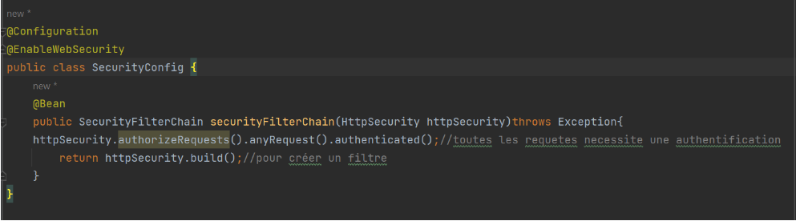

Voici les trois méthodes d'authentification distinctes :

<ul>
<li>InMemoryAuthentication</li>

 L'authentification en mémoire, nommée <strong>InMemoryAuthentication</strong> dans Spring 
Security, permet de stocker directement en mémoire les données d'identification. Cette approche est 
spécialement adaptée aux situations de développement légères ou lorsque la gestion des utilisateurs
reste minime. Dans ce schéma, les informations telles que les noms d'utilisateur, les mots de passe et 
les rôles sont statiquement configurées dans la mémoire de l'application. Cette méthode offre une gestion 
rapide et simple des utilisateurs au niveau de la configuration de l'application, sans nécessiter de 
stockage persistant. Elle est souvent privilégiée pour les tests et les phases de développement rapides.

<li>JdbcAuthentication</li>

<strong>La méthode <strong>JdbcAuthentication</strong> s'appuie sur une source de données JDBC 
(Java Database Connectivity) pour stocker et récupérer les informations d'identification des 
utilisateurs. Ces données, comprenant les noms d'utilisateur, les mots de passe et les rôles, 
sont enregistrées dans une base de données relationnelle telle que MySQL, PostgreSQL ou H2. 
L'authentification s'effectue en interrogeant cette base de données pour vérifier les informations
d'identification fournies lors de la connexion. Cette approche assure une gestion centralisée des 
utilisateurs, facilitant les mises à jour sans nécessiter de modifications directes dans le code de
l'application. 

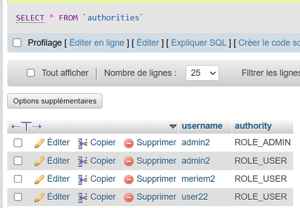
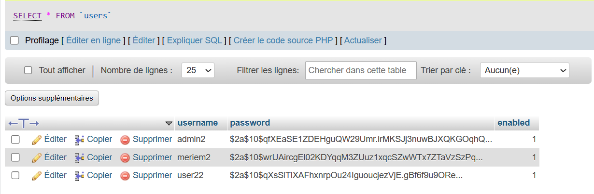

<li>UserDetailsService</li>

<strong>UserDetailsService</strong> est une interface de Spring Security qui permet de charger les 
informations d'identification des utilisateurs à partir d'une source externe personnalisée. Les classes 
implémentant cette interface définissent leur propre logique pour récupérer les informations 
d'identification à partir de diverses sources telles que des bases de données, des services web ou 
d'autres systèmes d'authentification personnalisés. Cette méthode offre une grande flexibilité, 
adaptée aux situations où la gestion des utilisateurs est complexe ou nécessite des intégrations 
spécifiques avec des systèmes existants. Les informations d'identification peuvent être stockées dans 
différentes sources, et la logique de chargement est configurée selon les besoins spécifiques de 
l'application.

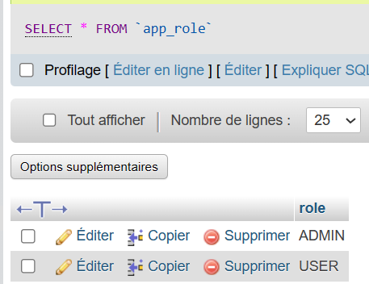
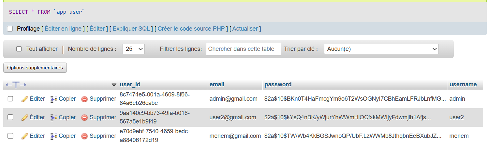
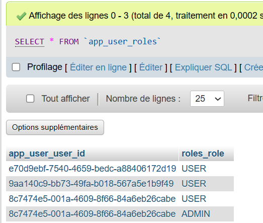

</ul>
<li>Sécuriser les données des utilisateurs</li>

Pour garantir la sécurité des données des utilisateurs, nous avons opté pour une méthode 
de stockage sécurisé des mots de passe. L'utilisation d'un encodeur de mots de passe tel que 
BCryptPasswordEncoder est démontrée par l'exemple passwordEncoder.encode("1234"). Cette pratique 
illustre le hachage du mot de passe "1234" à l'aide de l'encodeur avant d'être enregistré en mémoire. 
Cette approche courante renforce la sécurité en stockant les mots de passe sous forme de hachages plutôt 
qu'en texte brut, réduisant ainsi les risques liés au stockage d'informations sensibles.

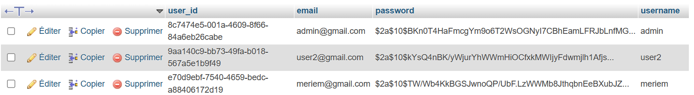

<li>Gérer les droits d'accès</li>

Pour présenter la liste des patients, nous avons utilisé Thymeleaf, un moteur de template, pour rendre dynamique l'affichage des données. De plus, l'intégration de WebJars a permis d'incorporer des styles modernes issus de bibliothèques externes, offrant ainsi une présentation attrayante et efficace des informations sur les patients. Cette approche garantit une expérience visuelle cohérente et plaisante pour les utilisateurs. En termes d'accès, tous les utilisateurs peuvent consulter les données, avec des restrictions fonctionnelles spécifiques pour les utilisateurs réguliers. Les utilisateurs administrateurs bénéficient, quant à eux, d'un accès étendu et de fonctionnalités supplémentaires.

<h3>Pages Accessibles par l'Administrateur</h3>

Les administrateurs ont des privilèges étendus et peuvent accéder à des fonctionnalités avancées
pour la gestion des patients. Ils ont la possibilité de visualiser, ajouter, modifier et supprimer 
des données, 

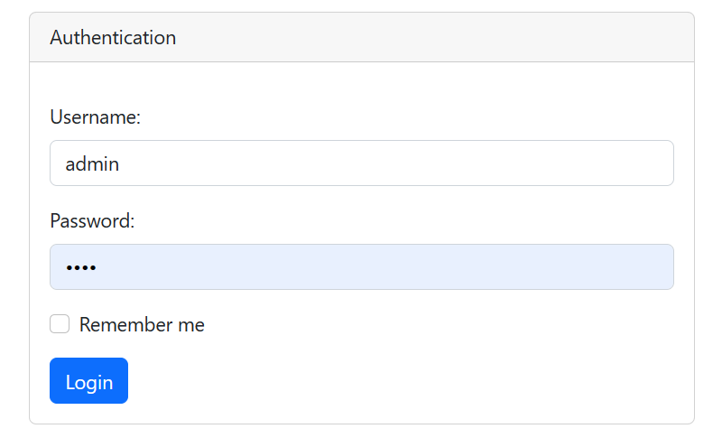
<ol>
<li>Visualiser la liste des patient</li>
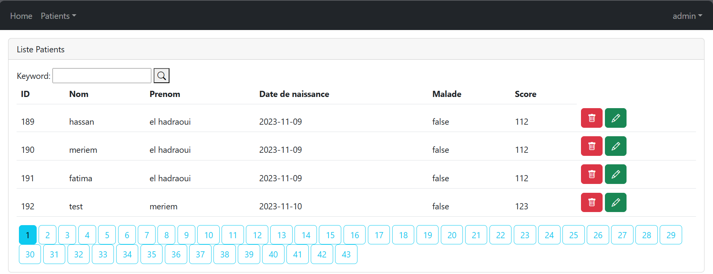

<li>Chercher un patient</li>
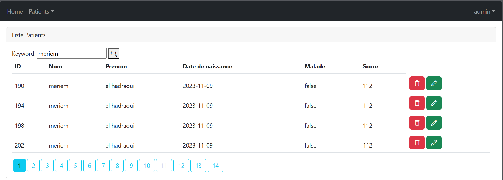

<li>Ajouter un patient</li>
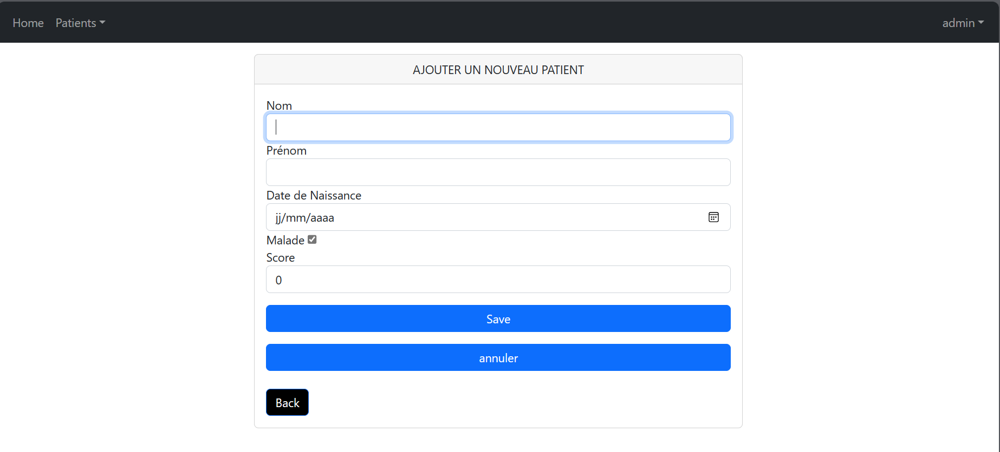

<li>Modifier un patient</li>
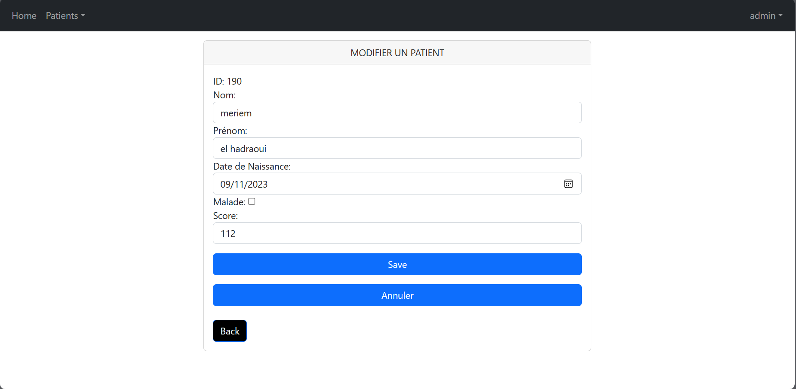

<li>Supprimer un patient</li>
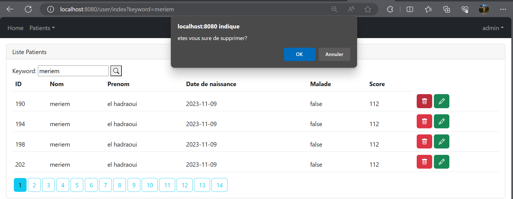

</ol>

<h3>Pages Accessibles par un Utilisateur Normal</h3>

Les utilisateurs normaux ont un accès restreint, focalisé sur la consultation des données. 
Ils peuvent parcourir la liste des patients et effectuer des recherches.

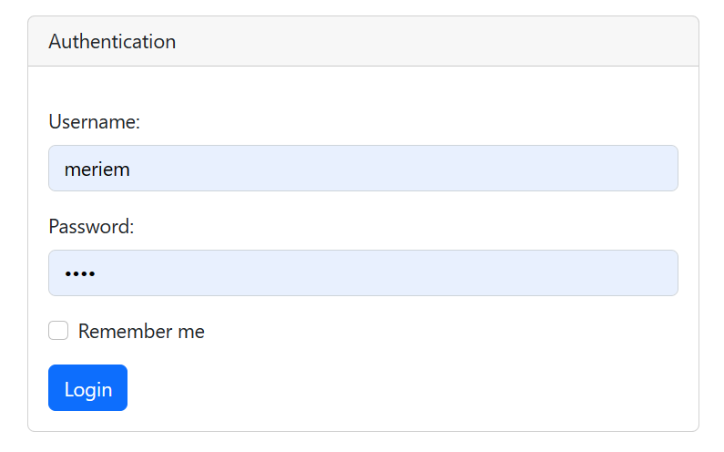

<ol>
<li>Visualiser la liste des patient</li>
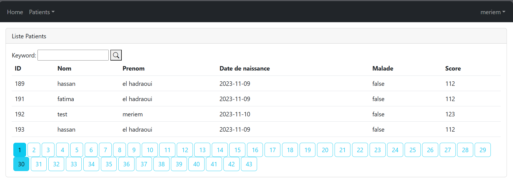
<li>Chercher un patient</li>
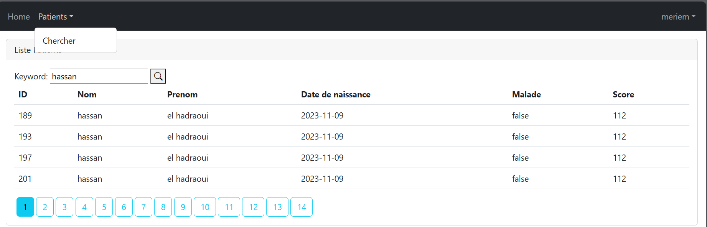
<li>Supprimer un patient</li>
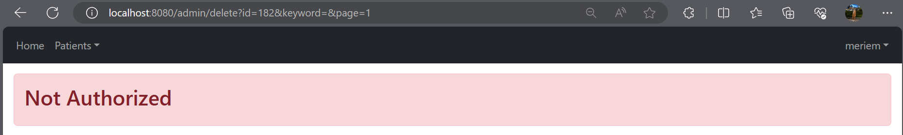
</ol>

</ol>
<h2>Conclusion</h2>

Le rapport met en lumière un projet de développement web JEE utilisant les frameworks Spring Boot
et Spring Security, centré sur la gestion complète des patients. Ce projet intègre des fonctionnalités 
CRUD, une sécurité renforcée via trois stratégies d'authentification distinctes, et prend en charge deux
bases de données, H2 et MySQL. Il détaille la conception, la réalisation et l'implémentation de diverses 
fonctionnalités telles que l'affichage, la pagination, la recherche, l'ajout, la modification et la 
suppression des patients. De plus, il aborde la différenciation des droits d'accès entre les
administrateurs et les utilisateurs standards.

